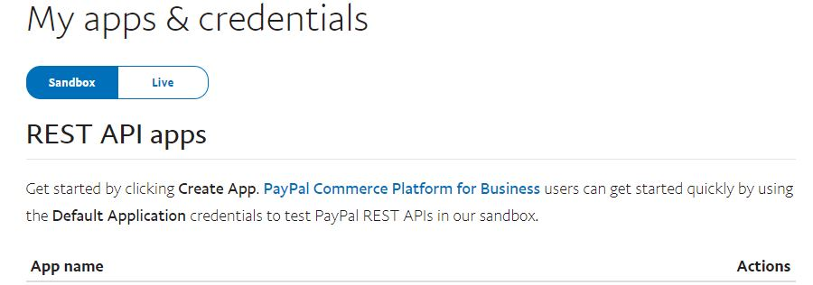

# Bet.AspNetCore.PayPalExpressCheckout.PayPalExpressCheckout

[](https://raw.githubusercontent.com/kdcllc/Bet.AspNetCore.PayPalExpressCheckout/master/LICENSE)
[](https://ci.appveyor.com/project/kdcllc/bet-aspnetcore-paypalexpresscheckout)
[](https://www.nuget.org/packages?q=Bet.AspNetCore.PayPalExpressCheckout)

[](https://f.feedz.io/kdcllc/kdcllc/packages/Bet.AspNetCore.PayPalExpressCheckout/latest/download)


[](https://www.buymeacoffee.com/vyve0og)

## Give a Star! :star:

The goal of this repo is to provide a light-weight reusable library for PayPal Express Check out and also provide with AspNetCore Example of using PayPal Express Checkout.

1. Login to [PayPal Developer Dashboard](https://developer.paypal.com/developer/applications) and create an application for Sandbox/Production:


2. [Create/Configure Payee Accounts](https://developer.paypal.com/developer/accounts/)

## `Bet.AspNetCore.PayPalExpressCheckout`

The design purpose of this library is to provide consistent way to utilize `PayPal` checkout APIs.

- [`PayPalCheckoutSdk` nuget package](https://www.nuget.org/packages/PayPalCheckoutSdk/1.0.3)
- [`PayPalHttp` nuget package](https://www.nuget.org/packages/PayPalHttp/1.0.0)
- [`PayPalCheckoutSdk` repo](https://github.com/paypal/paypalhttp_dotnet)
- [`PayPalHttp` repo](https://github.com/paypal/Checkout-NET-SDK)

### Install

```bash
    dotnet add package Bet.AspNetCore.PayPalExpressCheckout
```

### Usage

1. Configure PayPal Options

```json
  "PayPalExpressCheckoutOptions": {
    "ClientId": "<client id>",
    "ClientSecret": "<client secret>",
    "IsSandBox": true,
    "CancelUrl": "/cancel",
    "ReturnUrl": "/success",
    "BaseHostUrl": ""
  }
```

2. Add registration to DI

```csharp
   services.AddPayPalExpressCheckout();
```

3. Add Controller and view for checkout process

`Checkout.cshtml`
```csharp
@{
    ViewData["Title"] = "Checkout Page";
}

@model CheckoutFormViewModel

<div id="paypal-button-container"></div>

<script src="https://www.paypal.com/sdk/js?client-id=@Model.ClientId&currency=USD&disable-funding=credit,card"></script>

<script>
    let cartId = '@Model.CartId';
    let returnUrl = '@Model.ReturnUrl';
    let cancelUrl = '@Model.CancelUrl';
</script>

<script src="js/paypal.js"></script>

```

4. Use this JavaScript as a template

```javascript


paypal.Buttons({

    style: {
        color: 'blue',
        shape: 'pill',
        label: 'pay',
        height: 40
    },

    createOrder: function (data, actions) {
        return fetch('/api/paypal/createorder?cartId=' + cartId, {
            method: 'POST',
        }).then(function (res) {
            if (res.ok === false) {
                alert("Something went wrong");
                return;
            }
            return res.json();
        }).then(function (data) {

            var errorDetail = Array.isArray(data.details) && data.details[0];
            if (errorDetail) {
                var msg = 'Sorry, your transaction could not be processed.';
                if (errorDetail.description) msg += '\n\n' + errorDetail.description;
                if (data.debug_id) msg += ' (' + data.debug_id + ')';
                // Show a failure message
                window.location = cancelUrl + '/?error=' + encodeURI(msg);
                //return alert(msg);
            }

            return data.id;
        });
    },

    onApprove: function (data, actions) {
        return fetch('/api/paypal/approveorder?orderId=' + data.orderID, {
            method: 'POST'
        }).then(function (res) {

            if (res.ok === false) {
                alert("Something went wrong");
                return;
            }

            return res.json();
        }).then(function (orderData) {

            var msg = 'Sorry, your transaction could not be processed.';

            // Three cases to handle:
            //   (1) Recoverable INSTRUMENT_DECLINED -> call actions.restart()
            //   (2) Other non-recoverable errors -> Show a failure message
            //   (3) Successful transaction -> Show a success / thank you message

            // Your server defines the structure of 'orderData', which may differ
            var errorDetail = Array.isArray(orderData.details) && orderData.details[0];

            if (errorDetail && errorDetail.issue === 'INSTRUMENT_DECLINED') {
                // Recoverable state, see: "Handle Funding Failures"
                // https://developer.paypal.com/docs/checkout/integration-features/funding-failure/
                return actions.restart();
            }

            if (errorDetail) {
                if (errorDetail.description) msg += '\n\n' + errorDetail.description;
                if (orderData.debug_id) msg += ' (' + orderData.debug_id + ')';
                // Show a failure message
                window.location = cancelUrl + '/?error=' + encodeURI(msg);
                return;
                //return alert(msg);
            }

            if (orderData.Name !== "") {
                msg += "\n\n" + orderData.name + ' ' + orderData.message;
                window.location = cancelUrl + '/?error=' + encodeURI(msg);
                return;
                //return alert(msg);
            }

            // Show a success message to the buyer
            alert('Transaction completed by ' + orderData.payer.name.given_name);

            window.location = returnUrl + "/?orderId=" + orderData.id;
        });
    }
}).render('#paypal-button-container');

```

## Note on Negative testing

Since this is still in beta not all of the codes return details.

```csharp
    var request = new OrdersCaptureRequest(orderId);

    // in order for mock responses to work, the payer test account must be enabled in the dashboard.
    // https://developer.paypal.com/docs/api-basics/sandbox/error-conditions/#enable-negative-testing
    // codes: https://developer.paypal.com/docs/api/orders/v2/#errors
    request.Headers.Add("PayPal-Mock-Response", "{\"mock_application_codes\": \"INTERNAL_SERVICE_ERROR\"}");
```
## Issues with WSL2 Visual Studio debugging

If there is an issue with WSL2 not being able to serve on https://localhost:6001,
the run this command to restart WSL2 service:

```powershell
    wsl --showdown
```